<div align="center">

# ChronoUI

### Native Windows UIs in C++ that don't look like 1998 — and don't ship a browser.

[](#building)
[](#building)
[](#two-ways-to-build-a-screen)
[](#building)
[](LICENSE)

**Clone it, build it, run it — with nothing but Visual Studio and the Windows SDK.**
No vcpkg, no package manager, no runtime, no bundled browser. One `ChronoUI.dll`, GPU-accelerated, cold start under a second.

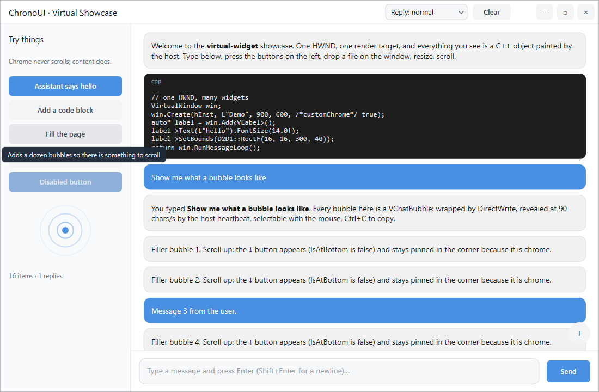

<sub>`VirtualShowcase`, the example you get in 60 seconds: a painted title bar, a pinned sidebar, streaming text, an animated custom widget, tooltips, drag & drop. One window, one render target, ~400 lines.</sub>

</div>

---

## Why this exists

Native Windows UI has been stuck for twenty years. The options are MFC (1992 ergonomics), WinUI (a moving target), Qt (licensing), or Electron (150 MB and half a gigabyte of RAM to draw a text box).

ChronoUI is the fourth option: **plain C++17 on Direct2D + DirectWrite**. A window is one HWND and one render target. Widgets are C++ objects with a paint method, or hot-pluggable DLLs with CSS-like styling. The core is about 9,000 lines you can read in an afternoon, and it has **zero external dependencies** — the whole framework, its 23 widgets and every example build against the Windows SDK alone.

It is also, deliberately, **easy for a language model to extend** — and that is not a slogan, it is the project's own history. See [Credits](#credits).

**Honest scope:** Windows only. Direct2D goes deep into the design, so a Linux or macOS port is a rewrite, not a port. If that is a dealbreaker, stop here — no hard feelings.

---

## 60 seconds

```bash
git clone https://github.com/vider73/ChronoUI.git
cd ChronoUI
cmake -S . -B build -A x64
cmake --build build --config Release --target VirtualShowcase
build\Release\VirtualShowcase.exe
```

That is the whole prerequisite list: Visual Studio 2022 with the Desktop C++ workload, and CMake. Nothing to install first, nothing to configure.

---

## The examples

Thirteen small programs, one `.cpp` each, linking `ChronoUI.dll` and nothing else. Every one teaches a few mechanisms and stays short enough to hand to a model as a template. **[docs/EXAMPLES.md](docs/EXAMPLES.md)** walks through each with the code that matters and prompts that have been tried.

| | |
|---|---|
| 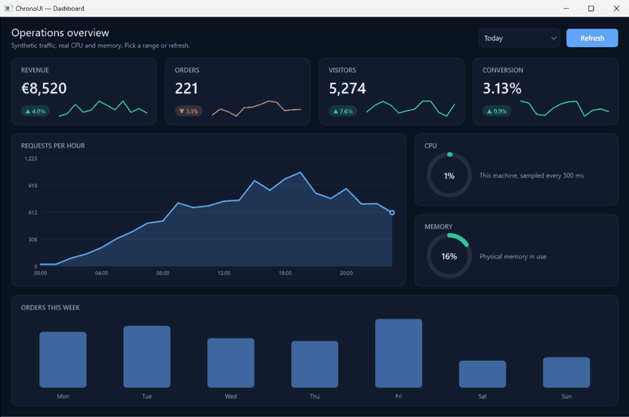 **Dashboard** — animated KPI cards, a morphing area chart, ring gauges on this machine's real CPU and memory, staggered bars. | 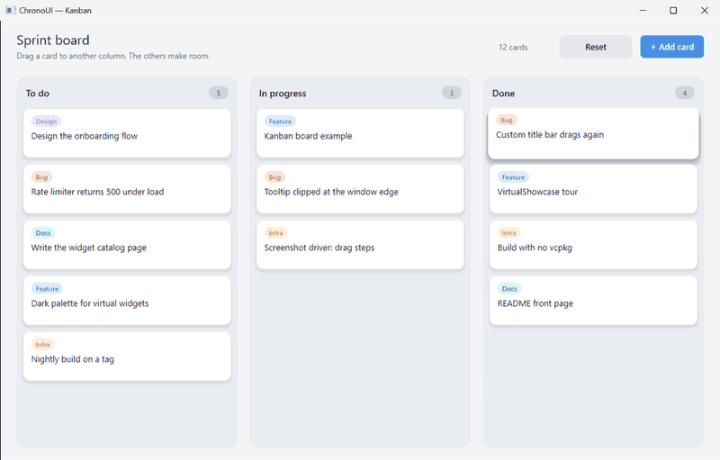 **Kanban** — drag a card and the others slide to make room; mouse capture, eased motion, a tilted ghost. |
| 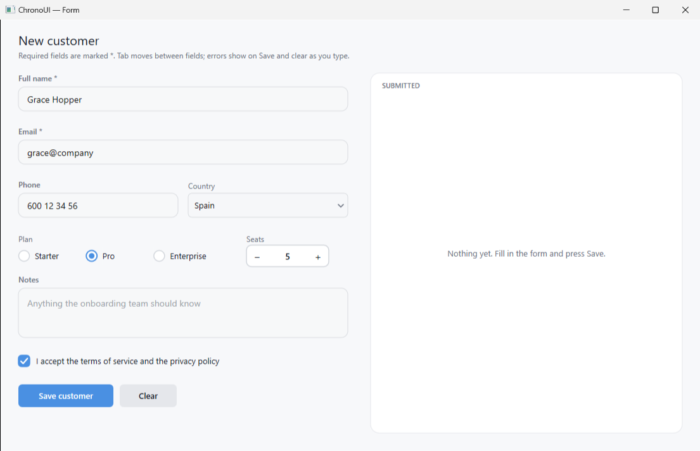 **Form** — a real data-entry form: validation with inline errors, Tab order, a toast, a list of what was saved. | 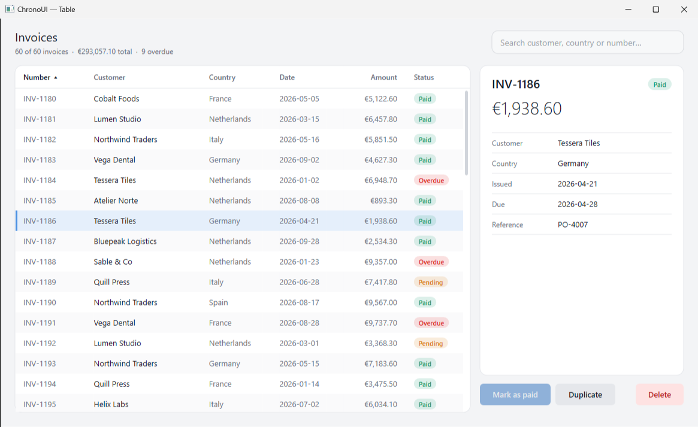 **Table** — a sortable, filterable grid with a detail panel and buttons that edit the data. |
| 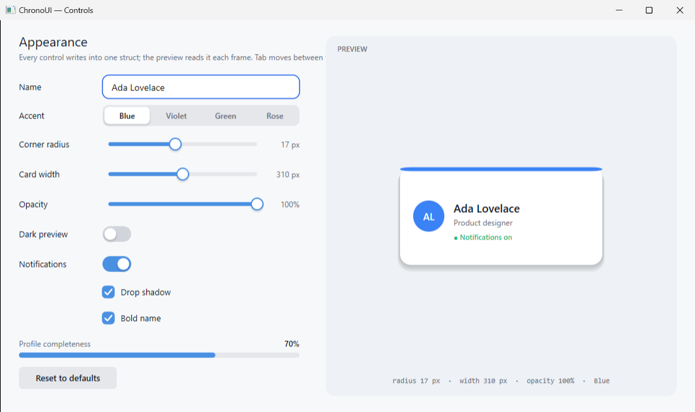 **Controls** — toggle, sliders, checkboxes, segmented picker, progress and a text field driving a live preview. | 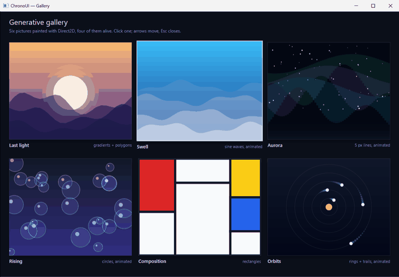 **Gallery** — six procedural artworks, four of them alive, with an animated lightbox and keyboard navigation. |
| 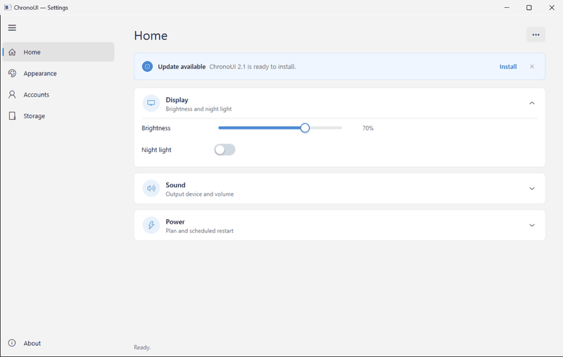 **Settings** — an app shell in the WinUI 3 vocabulary: navigation, tabs, expanders, info bar, menu, date picker, list, tree. | 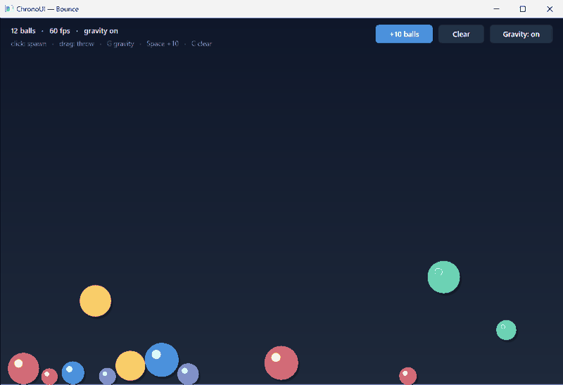 **Bounce** — a physics toy: gravity, collisions, throw a ball with the mouse. `OnUpdate(dt)` as a simulation step. |
| 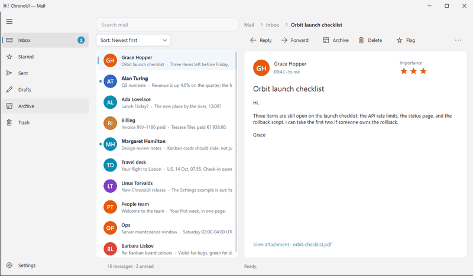 **Mail** — three panes: folders with a badge, a searchable list with avatars, a command bar with overflow, a modal dialog before Delete. | 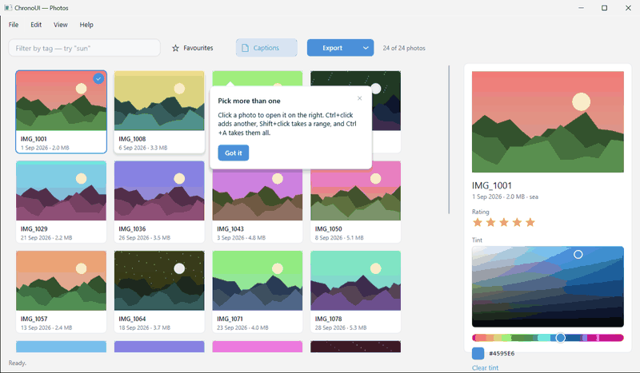 **Photos** — a menu bar, a grid of painted pictures, search suggestions, a colour picker that tints, a split button, a teaching tip. |
|  **VirtualShowcase** — the guided tour: custom chrome, streaming bubbles, tooltips, file drop, scroll-aware chrome. | 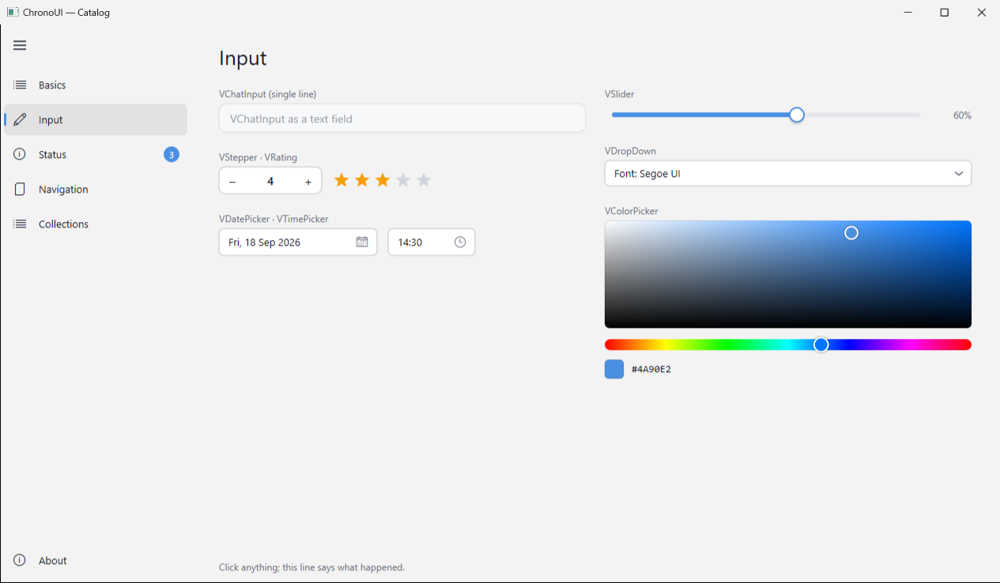 **Catalog** — the reference sheet: every widget in its resting state, one page per family. |

---

## Two ways to build a screen

They share one Direct2D controller, and a single app can mix them freely.

### 1. Virtual widgets — one HWND, a scene graph, 60 Hz

`VirtualWindow` owns a single window and a single render target. Widgets are C++ objects with bounds and a paint method. Hit-testing, hover, capture, focus, keyboard routing, tooltips, smooth scrolling, a painted title bar with drag/resize, file drop and an animation heartbeat are all handled for you.

```cpp
ChronoControllerImpl::Instance();

VirtualWindow win;
win.Create(hInstance, L"Hello", 480, 280);

auto* counter = win.Add<VLabel>();
counter->Text(L"Clicks: 0").FontSize(14.0f);
counter->SetBounds(D2D1::RectF(24, 80, 456, 130));

auto* btn = win.Add<VButton>();
btn->Text(L"Click me");
btn->SetBounds(D2D1::RectF(180, 180, 300, 220));
btn->OnClick([&] { counter->Text(L"Clicked!"); InvalidateRect(win.GetHWND(), NULL, FALSE); });

return win.RunMessageLoop();
```

Writing your own widget is two methods — `OnDraw(renderTarget)` and, if it moves, `OnUpdate(dt)` returning `true` while it wants another frame. `VDraw.hpp` supplies the vocabulary inside `OnDraw` (`vd::Fill`, `vd::Text`, `vd::Arc`, `vd::Gradient`, easing, colours), so paint code reads like a description of the picture. This is the model behind every example above and every app below.

The widgets an app needs come with it: `VLabel`, `VButton`, `VCombo`; the form controls in `VControls.hpp` (toggle, check, radio, segmented picker, slider, stepper, progress); the WinUI-style app shell in `VNavigation.hpp` (`VNavView`, `VTabView`, `VExpander`, `VInfoBar`, `VMenu`, `VDatePicker`, all on the light-dismiss `VFlyout`); `VListView` and `VTreeView` in `VCollections.hpp`; `VDropDown`, `VCommandBar`, `VMenuBar`, `VSplitButton`, `VToggleButton`, `VBreadcrumb`, `VSuggestions`, the modal `VDialog` and `VLink` in `VActions.hpp`; `VGridView` next to the list and tree; `VColorPicker`, `VTimePicker` and `VTeachingTip` with their families; `VProgressRing`, `VRating`, `VBadge` and `VPersonPicture` in `VIndicators.hpp`; and the chat set in `VirtualChat.hpp` (bubbles with streamed text and inline images, code blocks, a real text editor). Tab and Shift+Tab move focus between any of them.

### 2. DLL widgets — `cw.*.dll`, CSS-styled, generated by prompt

Each widget is a single `.cpp` compiled to its own DLL, created by name, and styled with classes:

```cpp
auto* btn = WidgetFactory::Create("cw.Button.dll");
btn->SetProperty("title", "Submit")
   ->AddClass("btn btn-primary")
   ->Bind("disabled", isWorking)                 // reactive: set the variable, UI follows
   ->addEventHandler("onClick", [](IWidget* s, const char* json) { /* … */ });
```

Every widget DLL exports a **JSON manifest** — properties, types, defaults, events. That is what makes the model extensible by prompt: hand an assistant one existing widget file and it has the entire contract. **23 widgets ship today**: buttons, inputs, switches, sliders, cards, an image viewer with a magnifier, a real-time plot, a CRT-style vitals monitor, an LED equalizer, three gauges, clocks, mouse-following eyes, and snow / storm / spinner overlays.

| `ChronoUIDemo` — everything at once | `WidgetTesterDemo` — live property inspector |
|---|---|
| 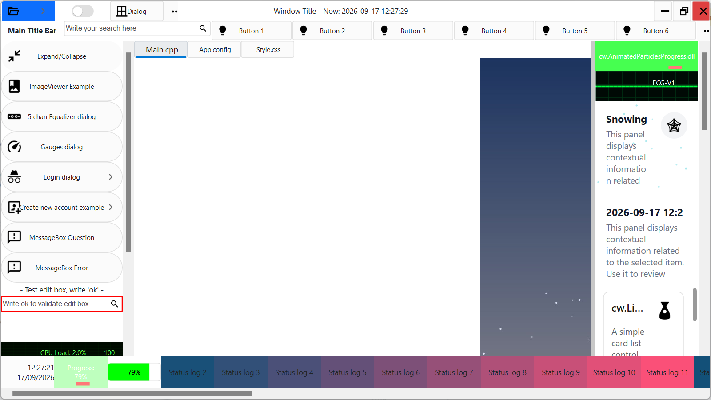 | 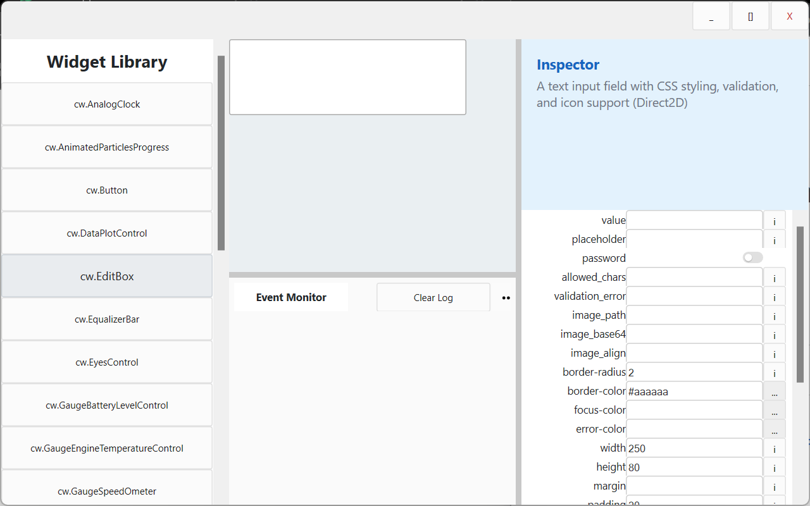 |

Full reference for both models, widget by widget: **[docs/WIDGETS.md](docs/WIDGETS.md)**.

---

## Built with it

| App | What it is | Where it lives |
|---|---|---|
| **JLToys** | A tray of 13 desktop minitools: magnifier, annotating snipper, colour picker, crosshair HUD, calibrated ruler, notes with alarms, clipboard memory with OCR, world clock, timer, screen text grab, odometer, currency calculator, recents. | published at **[vider73/jltoys](https://github.com/vider73/jltoys)** |
| **ClaudeMM** | An organiser for Claude Code sessions: searchable list plus a pan/zoom mind map, tags, notes, drag & drop. | published at **[vider73/claudemm](https://github.com/vider73/claudemm)** |
| **ChronoChat** | An agentic chat client. Local models via Ollama or cloud via Gemini, ~120 tools, and a live spreadsheet the agent grows step by step with undo and a review-before-execute checkpoint. | a private repository |

<div align="center">
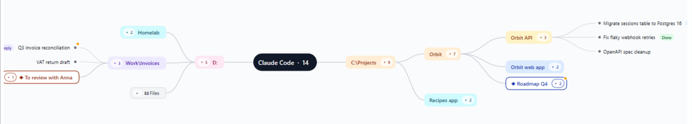
<br><sub>ClaudeMM — a mind map of Claude Code sessions, drawn by a single ChronoUI virtual widget.</sub>
</div>

These are the proof the framework carries real applications: dense scrolling panels, mind maps, always-on overlays, DPI-aware tool windows on multiple monitors. None of them uses a UI toolkit beyond ChronoUI.

---

## Building

**Prerequisites:** Visual Studio 2022 (Desktop C++) and CMake ≥ 3.21. That is all.

```bash
cmake -S . -B build -A x64
cmake --build build --config Release           # everything
cmake --build build --config Release --target VirtualShowcase   # just the tour
```

Output lands in `build/Release/`: `ChronoUI.dll`, the 23 `cw.*.dll` widgets, the examples (`VirtualShowcase`, `VirtualHello`, `Welcome`, `HelloWorld`, `LayoutTester`, `ChronoUIDemo`).

One of those wants one optional package. `WidgetTesterDemo` parses JSON with nlohmann/json; without it that target is skipped with a message and everything else still builds:

```bash
vcpkg install nlohmann-json --triplet x64-windows
```

### Using ChronoUI from your own project

```cmake
set(CHRONOUI_BUILD_EXAMPLES OFF)      # just the library, no widgets/demos/apps
add_subdirectory(path/to/ChronoUI chronoui)
target_link_libraries(MyApp PRIVATE ChronoUI)
```

---

## Add a widget with a prompt

1. Pick the closest existing widget in `src/widgets/` as a template — `cw.GaugeSpeedOmeter.cpp` for anything circular, `cw.DataPlotControl.cpp` for graphs, `cw.Button.cpp` for inputs.
2. Paste it into your assistant of choice: *"Here is a ChronoUI widget. Write `cw.WifiSignalWidget` with a `signal_strength` property (0-100) that lights up four bars. Include the JSON manifest. One `.cpp`, ready to compile."*
3. Save it as `src/widgets/cw.WifiSignalWidget.cpp` and add that path to `WIDGET_SOURCES` in `CMakeLists.txt`.
4. `WidgetFactory::Create("cw.WifiSignalWidget.dll")->SetProperty("signal_strength", "75");`

---

## Contributing

Pull requests are welcome, including ones written mostly by a model — that is how the project got here. Good places to start:

- **A new `cw.*` widget.** Self-contained, one file, no coordination needed.
- **Tests for the parsers.** They are textual and easy to fuzz.
- **A GitHub Actions workflow** that builds and uploads a zip on tag.
- **A dark palette** for the virtual widgets.

See [CONTRIBUTING.md](CONTRIBUTING.md) for the conventions and the traps worth knowing.

---

## Repository map

```
include/            the whole framework, sixteen headers:
                    ChronoUI · ChronoStyles · WidgetImpl · ContextNodeImpl
                    VirtualWidget · VirtualChat · VControls · VNavigation
                    VCollections · VActions · VIndicators · VDraw
                    ChatImage · virtual_drive · funMessageBox · AppPaths
src/core/           layout engine, window management, CSS parser
src/widgets/        cw.*.cpp — one hot-pluggable DLL widget per file
src/examples/       the thirteen virtual-widget examples (docs/EXAMPLES.md) + the cw.* demos
tools/shoot.ps1     the screenshot driver behind every image in this README
docs/               EXAMPLES.md, WIDGETS.md and screenshots/
```

`tools/shoot.ps1` launches an executable, waits for its window, optionally drives it with keystrokes and clicks, and saves the PNG — every screenshot here is generated, not hand-cropped.

---

## Credits

**Architect:** Jose Luis Rey Mejías — [@vider73](https://github.com/vider73). Decades of MSVC C++ and a long grudge against the state of native Windows UI.

**Written with models, on purpose.** The first widget set and the layout/CSS engine came out of pair-programming sessions with **Gemini**. The virtual-widget model, the apps and most of what you are reading were built with **Claude Code**. The codebase is shaped so that a model can pick it up and extend it — small self-contained files, declared contracts, conventions written down in `CLAUDE.md`. That is the whole thesis, and the repo is the evidence.

**License:** [MIT](LICENSE). Material Design icons keep their own licence, in `assets/`.

<div align="center">
<sub>If you build something with it, open an issue and show it off.</sub>
</div>
