<div align="center">

# ChronoUI

### The Windows UI framework a language model can drive: headers only, no dependencies, good-looking by default.

[](#building)
[](#building)
[](#how-a-screen-is-built)
[](#building)
[](https://github.com/vider73/ChronoUI/actions/workflows/build.yml)
[](LICENSE)

**Tell your assistant what the app should do, hand it one example as a template, and get a native Windows program back: one `.cpp`, the Windows SDK, nothing to install and nothing to ship next to the exe.**
About seventy widgets in the WinUI 3 vocabulary, light and dark, GPU-accelerated, cold start under a second. No vcpkg, no package manager, no runtime, no bundled browser, no XAML, no DLL.

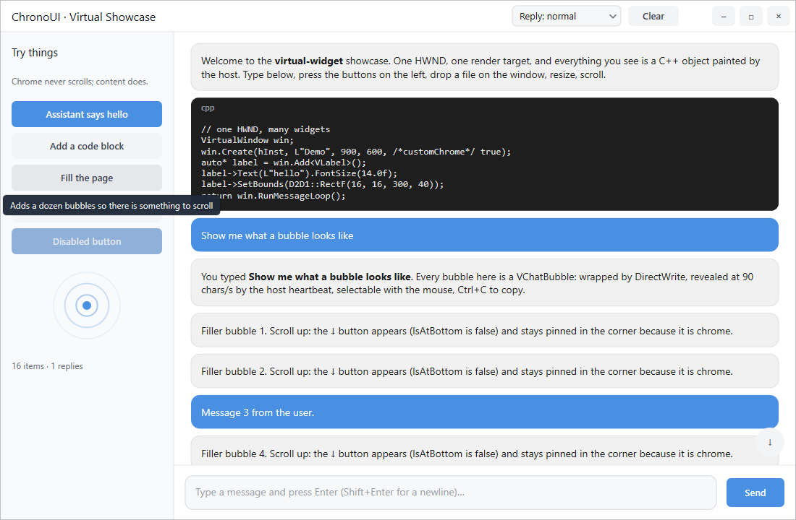

<sub>`VirtualShowcase`, the example you get in 60 seconds: a painted title bar, a pinned sidebar, streaming text, an animated custom widget, tooltips, drag & drop. One window, one render target, ~400 lines.</sub>

</div>

---

## Why this exists

Ask a model for a Windows desktop app today and you get Electron (150 MB and half a gigabyte of RAM to draw a text box), or a fight with WinUI and XAML, or MFC with its 1992 ergonomics. None of those is something a model does well from a prompt, and none of them looks good without a designer.

ChronoUI is the other option: **plain C++17 on Direct2D + DirectWrite**. A window is one HWND and one render target. A widget is a C++ object with a paint method; a screen is one function that places widgets in rectangles. The framework is fourteen headers you can read in an afternoon, it has **zero external dependencies**, and everything in it builds against the Windows SDK alone.

It was written with models, on purpose, and it is shaped so that a model can pick it up: see [Made for a model to drive](#made-for-a-model-to-drive) and [Credits](#credits).

**Honest scope:** Windows only. Direct2D goes deep into the design, so a Linux or macOS port is a rewrite, not a port. If that is a dealbreaker, stop here — no hard feelings.

---

## 60 seconds

```bash
git clone https://github.com/vider73/ChronoUI.git
cd ChronoUI
cmake -S . -B build -A x64
cmake --build build --config Release --target VirtualShowcase
build\Release\VirtualShowcase.exe
```

That is the whole prerequisite list: Visual Studio 2022 with the Desktop C++ workload, and CMake. Nothing to install first, nothing to configure.

---

## Made for a model to drive

What makes a UI framework usable from a prompt is not magic, it is a handful of properties that most frameworks do not have and this one was built around:

- **An app is one file.** Every example is a single `.cpp` of 200 to 400 lines that includes headers and nothing else. The whole program fits in a context window, so the model reads all of it and writes all of it. No project wizard, no XAML, no resource files, no designer.
- **Every widget has the same shape.** Chainable setters, one `OnChange`, `SetBounds` for where it goes. Once a model has seen `VSlider` it can use `VCalendarView`. There are about seventy of them, named after the WinUI 3 controls they correspond to, so a model that knows Windows already knows the vocabulary.
- **Layout is a function.** No constraint solver, no XAML tree: `layout()` puts rectangles where they go, and containers that move (a split view opening, an expander unfolding) call it back. A model can reason about it because it is arithmetic.
- **A widget is two methods.** `OnDraw` and, if it moves, `OnUpdate(dt)`. `VDraw.hpp` gives the paint code a vocabulary (`vd::Fill`, `vd::Text`, `vd::Arc`, gradients, easing) so a new widget is a description of the picture, not Direct2D plumbing.
- **It looks right without a designer.** Light and dark themes, WinUI-style spacing and motion, focus rings, tooltips, keyboard on everything. The [Catalog](#the-examples) shows each widget in its resting state, so a model can check its work against a picture.
- **The docs are written for the model too.** `CLAUDE.md` holds the conventions and the traps; [docs/EXAMPLES.md](docs/EXAMPLES.md) ends every example with prompts that have been tried; `tools/shoot.ps1` takes screenshots of an exe so an assistant can look at what it built.

The recipe, then: pick the example closest to what you want, paste it, and say what should change.

> *"Here is `Mail.cpp` from ChronoUI. Turn it into a support-ticket desk: tickets instead of mails, a priority badge on each row, a status selector bar above the list, and a Resolve button that asks for confirmation. Keep the layout function; only change what must change."*

That prompt, against a current model, comes back as a working program. Fourteen such starting points are below.

---

## The examples

Fourteen small programs, one `.cpp` each, header-only: they link nothing of ours, not even a DLL. Every one teaches a few mechanisms and stays short enough to hand to a model as a template. **[docs/EXAMPLES.md](docs/EXAMPLES.md)** walks through each with the code that matters and prompts that have been tried.

| | |
|---|---|
| 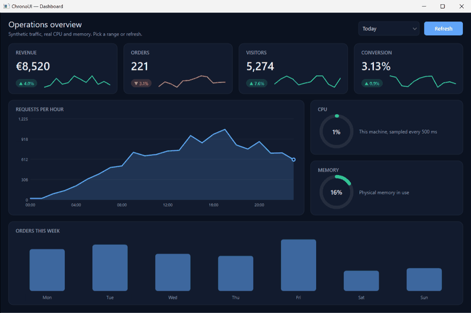 **Dashboard** — animated KPI cards, a morphing area chart, ring gauges on this machine's real CPU and memory, staggered bars. | 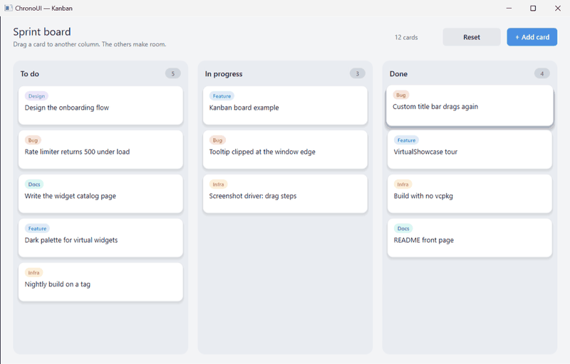 **Kanban** — drag a card and the others slide to make room; mouse capture, eased motion, a tilted ghost; each column scrolls. |
| 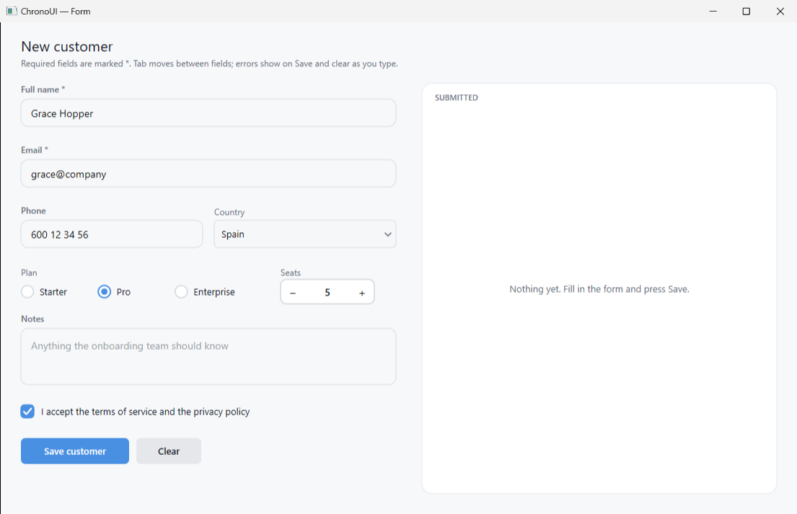 **Form** — a real data-entry form: validation with inline errors, Tab order, a toast, a list of what was saved. | 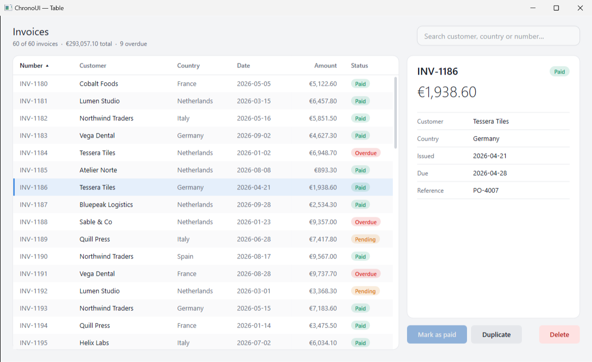 **Table** — a sortable, filterable grid with a detail panel and buttons that edit the data. |
| 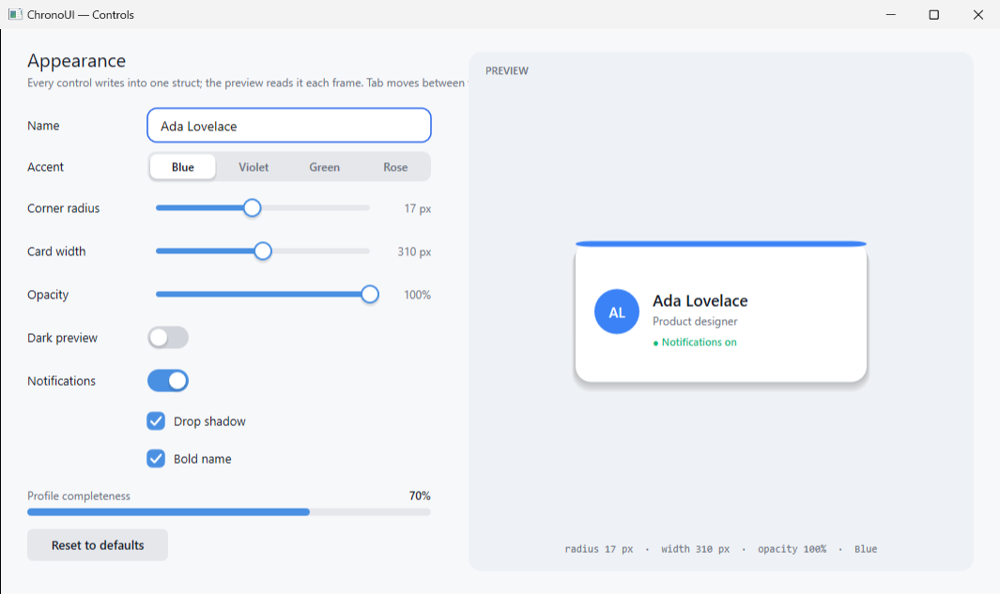 **Controls** — toggle, sliders, checkboxes, segmented picker, progress and a text field driving a live preview. | 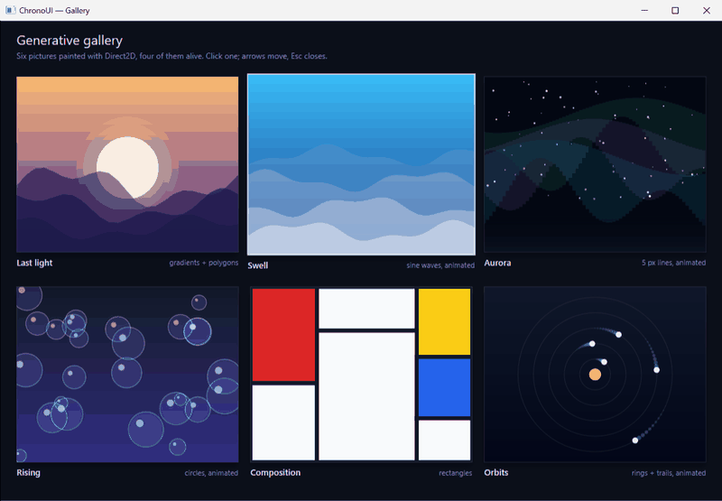 **Gallery** — six procedural artworks, four of them alive, with an animated lightbox and keyboard navigation. |
| 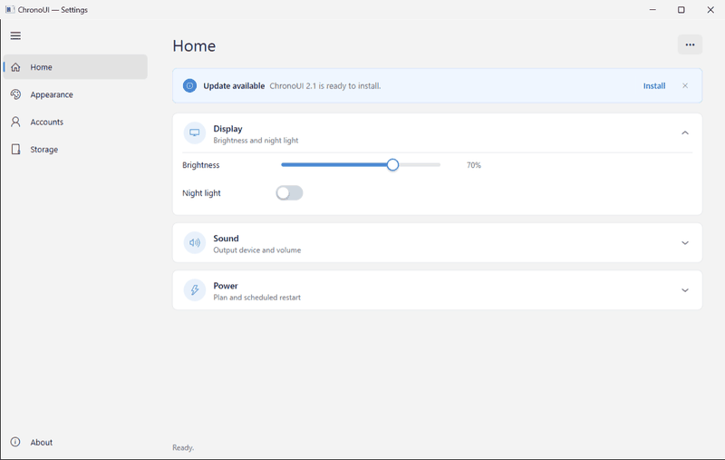 **Settings** — an app shell in the WinUI 3 vocabulary: navigation, tabs, expanders, info bar, menu, date picker, list, tree. | 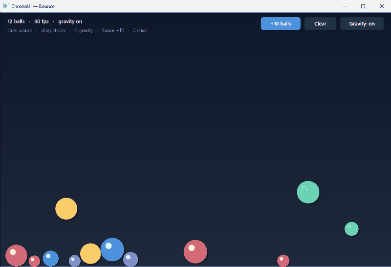 **Bounce** — a physics toy: gravity, collisions, throw a ball with the mouse. `OnUpdate(dt)` as a simulation step. |
| 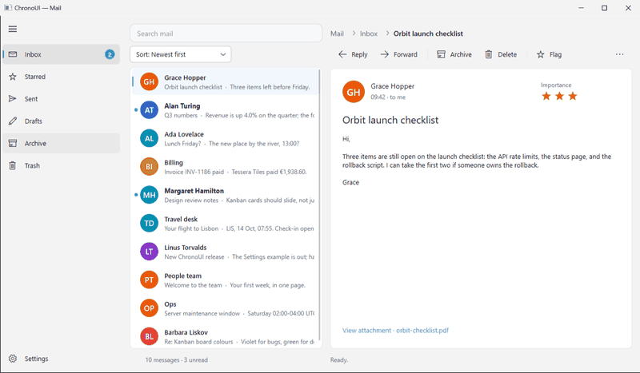 **Mail** — three panes: folders with a badge, a searchable list with avatars, a command bar with overflow, a modal dialog before Delete. | 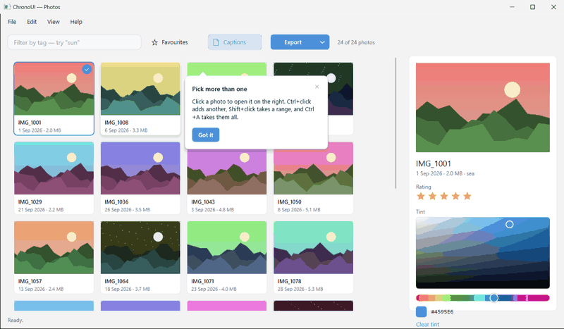 **Photos** — a menu bar, a grid of painted pictures, search suggestions, a colour picker that tints, a split button, a teaching tip. |
|  **VirtualShowcase** — the guided tour: custom chrome, streaming bubbles, tooltips, file drop, scroll-aware chrome. | 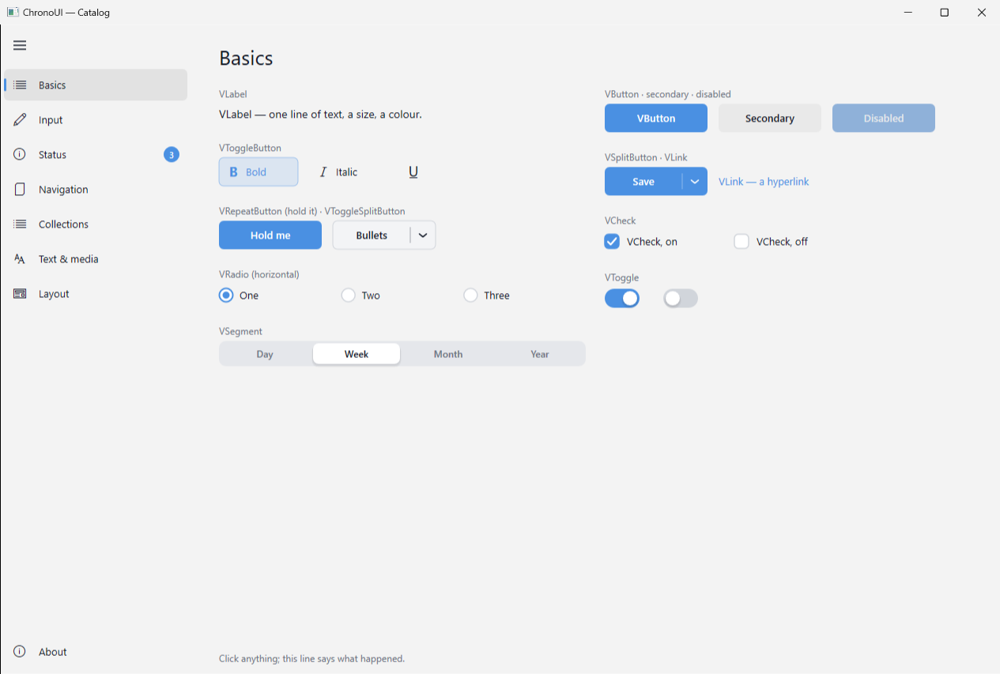 **Catalog** — the reference sheet: every widget in its resting state, one page per family. |
| 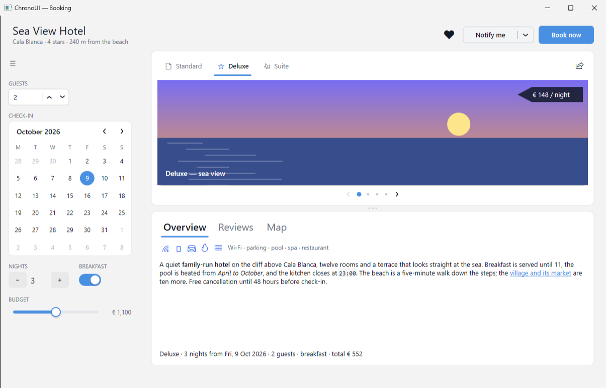 **Booking** — a hotel stay: split view, calendar, number box, repeat buttons, flip view with pips, selector bar, pivot, rich text, a zoomable map in a scroll viewer. | 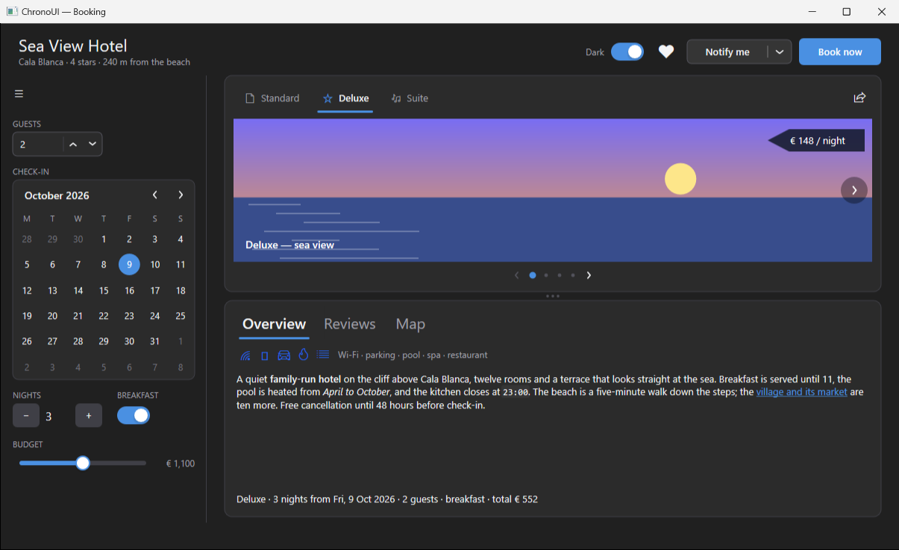 **The same, dark** — every widget reads `VTheme` at draw time; `vtheme::SetDark(true)` and a repaint restyle the window. |
| 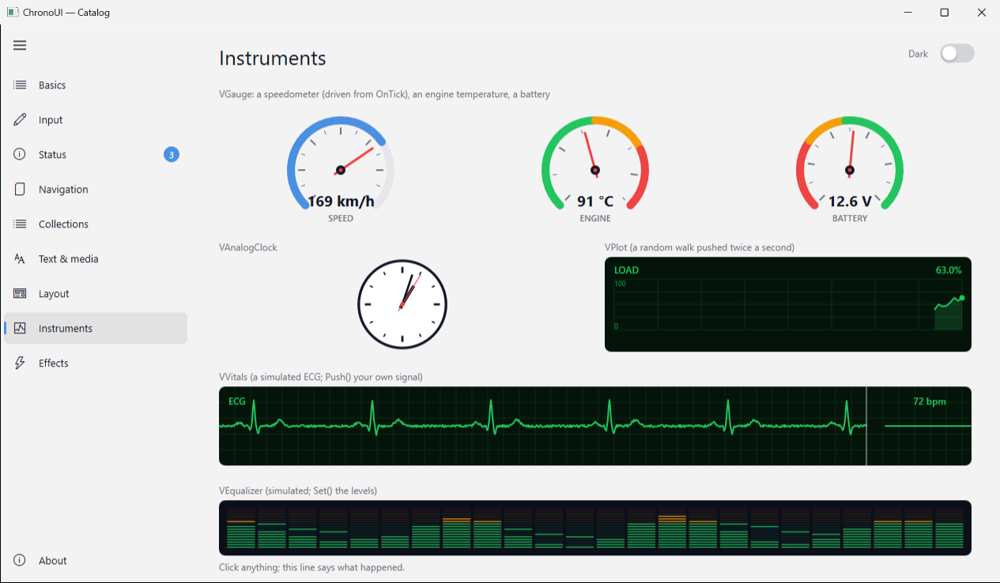 **Instruments** — gauges with zones and a gliding needle, a clock, an ECG trace, an LED equalizer, a scrolling plot: the Catalog's dashboard page. | 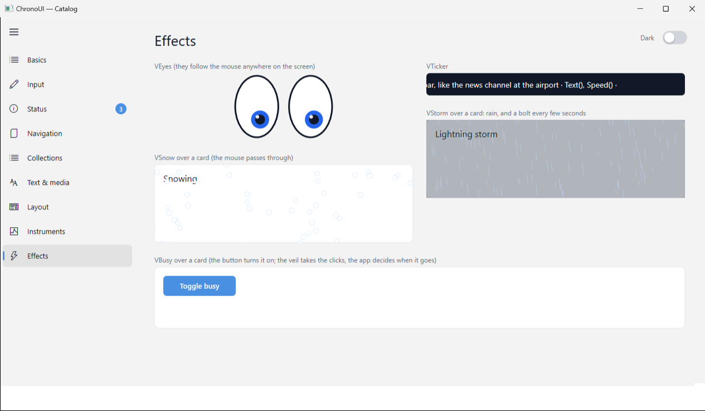 **Effects** — eyes that follow the mouse, snow and a lightning storm over a card, a ticker, a busy veil. |

---

## How a screen is built

`VirtualWindow` owns a single window and a single render target. Widgets are C++ objects with bounds and a paint method. Hit-testing, hover, capture, focus, keyboard routing, tooltips, smooth scrolling, a painted title bar with drag/resize, file drop and an animation heartbeat are all handled for you.

```cpp
ChronoControllerImpl::Instance();

VirtualWindow win;
win.Create(hInstance, L"Hello", 480, 280);

auto* counter = win.Add<VLabel>();
counter->Text(L"Clicks: 0").FontSize(14.0f);
counter->SetBounds(D2D1::RectF(24, 80, 456, 130));

auto* btn = win.Add<VButton>();
btn->Text(L"Click me");
btn->SetBounds(D2D1::RectF(180, 180, 300, 220));
btn->OnClick([&] { counter->Text(L"Clicked!"); InvalidateRect(win.GetHWND(), NULL, FALSE); });

return win.RunMessageLoop();
```

Writing your own widget is two methods — `OnDraw(renderTarget)` and, if it moves, `OnUpdate(dt)` returning `true` while it wants another frame. `VDraw.hpp` supplies the vocabulary inside `OnDraw` (`vd::Fill`, `vd::Text`, `vd::Arc`, `vd::Gradient`, easing, colours), so paint code reads like a description of the picture. This is the model behind every example above and every app below.

The widgets come in families, one header each: the form controls in `VControls.hpp` (toggle, check, radio, segmented picker, slider, stepper, progress, colour picker); the app shell in `VNavigation.hpp` (`VNavView`, `VTabView`, `VExpander`, `VInfoBar`, `VMenu`, `VDatePicker`, `VTimePicker`, `VTeachingTip`, `VSelectorBar`, `VPivot`, `VCalendarView`, all on the light-dismiss `VFlyout`); `VListView`, `VTreeView`, `VGridView`, `VFlipView`, `VPipsPager` and `VAnnotatedScrollBar` in `VCollections.hpp`; `VDropDown`, `VCommandBar`, `VMenuBar`, the split and toggle buttons, `VBreadcrumb`, `VSuggestions`, the modal `VDialog`, `VLink` and `VCommandBarFlyout` in `VActions.hpp`; `VProgressRing`, `VRating`, `VBadge` and `VPersonPicture` in `VIndicators.hpp`; `VNumberBox`, `VPasswordBox` and `VRichText` in `VText.hpp`; `VImage`, `VShape`, `VIcon` and `VAnimatedIcon` in `VMedia.hpp`; `VScrollViewer`, `VSplitView` and `VTwoPaneView` in `VLayout.hpp`; gauges, a clock, an ECG, an equalizer and a plot in `VInstruments.hpp`; eyes, snow, a storm, a ticker and a busy veil in `VEffects.hpp`; and the chat set in `VirtualChat.hpp` (bubbles with streamed text and inline images, code blocks, a real text editor). Tab and Shift+Tab move focus between any of them. Widget by widget: **[docs/WIDGETS.md](docs/WIDGETS.md)**.

---

## Built with it

| App | What it is | Where it lives |
|---|---|---|
| **JLToys** | A tray of 13 desktop minitools: magnifier, annotating snipper, colour picker, crosshair HUD, calibrated ruler, notes with alarms, clipboard memory with OCR, world clock, timer, screen text grab, odometer, currency calculator, recents. | published at **[vider73/jltoys](https://github.com/vider73/jltoys)** |
| **ClaudeMM** | An organiser for Claude Code sessions: searchable list plus a pan/zoom mind map, tags, notes, drag & drop. | published at **[vider73/claudemm](https://github.com/vider73/claudemm)** |
| **ChronoChat** | An agentic chat client. Local models via Ollama or cloud via Gemini, ~120 tools, and a live spreadsheet the agent grows step by step with undo and a review-before-execute checkpoint. | a private repository |

<div align="center">
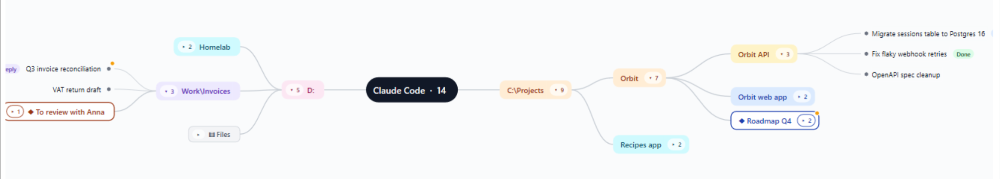
<br><sub>ClaudeMM — a mind map of Claude Code sessions, drawn by a single ChronoUI virtual widget.</sub>
</div>

These are the proof the framework carries real applications: dense scrolling panels, mind maps, always-on overlays, DPI-aware tool windows on multiple monitors. None of them uses a UI toolkit beyond ChronoUI.

---

## Building

**Prerequisites:** Visual Studio 2022 (Desktop C++) and CMake ≥ 3.21. That is all.

```bash
cmake -S . -B build -A x64
cmake --build build --config Release           # everything
cmake --build build --config Release --target VirtualShowcase   # just the tour
```

Output lands in `build/Release/`: the fourteen examples, each a standalone exe with nothing beside it.

### Using ChronoUI from your own project

There is nothing to build. Add the folder and link the interface target, which is the include path and nothing more:

```cmake
set(CHRONOUI_BUILD_EXAMPLES OFF)
add_subdirectory(path/to/ChronoUI chronoui)
target_link_libraries(MyApp PRIVATE ChronoUI::Virtual)
```

Or copy `include/` next to your sources. The Windows SDK libraries come in through `#pragma comment(lib)` in the headers.

---

## Working with a model

**A new screen.** Pick the example closest to what you want from [docs/EXAMPLES.md](docs/EXAMPLES.md), paste it, and describe the difference. Each example's section ends with prompts that have been tried. Keep the model on the example's `layout()` function: that is where every rectangle is decided, and it is the part a model gets right when it is arithmetic and wrong when it is a tree.

**A new widget.** Paste the closest one from `include/` (a `VSlider` for anything with a knob, `VListView` for anything with rows, `VGauge` for anything with a needle) and ask for yours: two methods, `OnDraw` and maybe `OnUpdate`, the same chainable setters, `OnChange` for the event, colours from `vctl::` so it works in both themes. Add it to the Catalog page it belongs to and shoot it with `tools/shoot.ps1` to see it.

**Let it see.** `tools/shoot.ps1 -Exe build\Release\MyApp.exe -Out shot.png` launches the exe, waits for the window and saves it as a PNG; the Catalog takes a page number and `dark` on the command line so every page can be shot without a click. A model that can read the picture fixes its own layout.

---

## Contributing

Pull requests are welcome, including ones written mostly by a model — that is how the project got here. Good places to start:

- **An example.** One `.cpp` that shows a kind of app the fourteen do not: a chat client, an installer, a music player, a log viewer.
- **A new widget.** One class in the header of its family, a cell in the Catalog, a row in `docs/WIDGETS.md`.
- **A second theme.** `VTheme` has light and dark; a high-contrast or a tinted one is a struct away.
- **Tests for the parsers.** They are textual and easy to fuzz.

See [CONTRIBUTING.md](CONTRIBUTING.md) for the conventions and the traps worth knowing.

---

## Repository map

```
include/            the whole framework, fourteen headers:
                    ChronoController (the D2D / DWrite / WIC factories)
                    VirtualWidget (the host, the theme) · VDraw · VControls
                    VNavigation · VCollections · VActions · VIndicators
                    VText · VMedia · VLayout · VInstruments · VEffects
                    VirtualChat · ChatImage · AppPaths
src/examples/       the fourteen examples (docs/EXAMPLES.md), one .cpp each
tools/shoot.ps1     the screenshot driver behind every image in this README
docs/               EXAMPLES.md, WIDGETS.md and screenshots/
```

`tools/shoot.ps1` launches an executable, waits for its window, optionally drives it with keystrokes and clicks, and saves the PNG — every screenshot here is generated, not hand-cropped.

---

## Credits

**Architect:** Jose Luis Rey Mejías — [@vider73](https://github.com/vider73). Decades of MSVC C++ and a long grudge against the state of native Windows UI.

**Written with models, on purpose.** The first generation, a DLL per widget with a CSS engine behind it, came out of pair-programming sessions with **Gemini**; it did its job and stepped aside. The virtual-widget model, the seventy widgets, the fourteen examples, the apps and most of what you are reading were built with **Claude Code**, one session per round, against the WinUI 3 controls list. The codebase is shaped so that a model can pick it up and extend it — small self-contained files, one shape for every widget, conventions written down in `CLAUDE.md`. That is the whole thesis, and the repo is the evidence.

**License:** [MIT](LICENSE).

<div align="center">
<sub>If you build something with it, open an issue and show it off.</sub>
</div>
