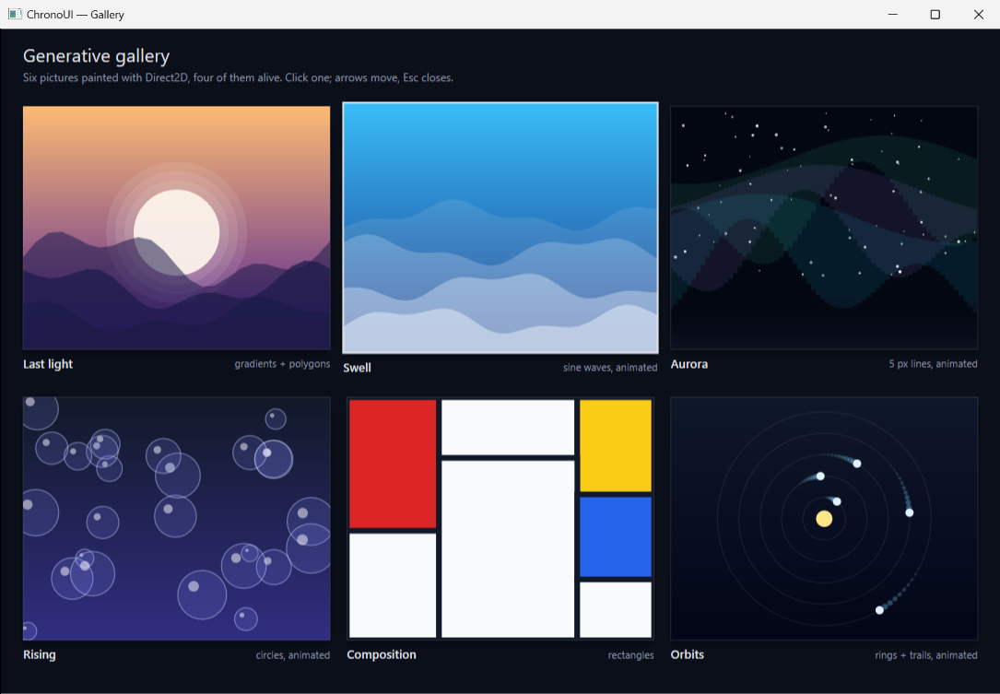

# ChronoUI — Examples

Thirteen small programs, each a single `.cpp` and nothing else: the virtual
widgets are headers, so no DLL of ours sits next to the exe. They are meant to be read as much as run: every one teaches a
handful of framework mechanisms and stays short enough to hold in your head,
which is also what makes them good raw material for a language model. Each
section ends with prompts that have been tried and produce working code.

Build everything with `cmake --build build --config Release`, or one at a time
with `--target Dashboard`. The executables land in `build/Release/`.

| Example | One line | Lines |
|---|---|---|
| [VirtualShowcase](#virtualshowcase--the-guided-tour) | Every host feature in one window | ~400 |
| [Dashboard](#dashboard--animated-panels-real-numbers) | KPI cards, area chart, rings, bars; real CPU and memory | ~330 |
| [Kanban](#kanban--drag-drop-with-cards-that-make-room) | Drag & drop with sliding cards | ~260 |
| [Controls](#controls--a-form-with-a-live-preview) | Toggle, slider, checkbox, segmented picker, progress, text field | ~230 |
| [Form](#form--data-entry-with-validation-and-tab-order) | A real form: validation, Tab order, a toast, a list of what was saved | ~300 |
| [Table](#table--a-data-grid-with-a-detail-panel) | Sortable, filterable grid with a detail panel and buttons that edit | ~380 |
| [Gallery](#gallery--six-procedural-pictures-and-a-lightbox) | Generative art, animated lightbox, keyboard | ~260 |
| [Bounce](#bounce--a-physics-toy) | Balls, gravity, throwing with the mouse | ~200 |
| [Settings](#settings--an-app-shell-in-the-winui-3-vocabulary) | Navigation, tabs, expanders, info bar, menu, date picker, list, tree | ~330 |
| [Mail](#mail--three-panes-a-command-bar-and-a-dialog) | Folders, a message list, a command bar with overflow, a modal dialog | ~300 |
| [Photos](#photos--a-menu-bar-a-grid-of-painted-pictures-a-colour-picker) | Menu bar, painted grid, search suggestions, colour picker, split button | ~300 |
| [Catalog](#catalog--every-widget-one-page-per-family) | The reference sheet: every widget on five pages | ~290 |
| VirtualHello | The smallest possible app: a label and a button | 60 |

Two things all of them share. **`VirtualWindow`** owns the single HWND and
render target, routes mouse and keyboard to widgets, runs a 60 Hz heartbeat and
repaints only while some widget asks for another frame. **`VDraw.hpp`** is the
drawing vocabulary they use inside `OnDraw` — `vd::Fill`, `vd::Text`,
`vd::Arc`, `vd::Gradient`, `vd::Polyline`, easing and colour helpers — so a
widget's paint code reads like a description of the picture.

---

## VirtualShowcase — the guided tour

**What it shows.** A custom-painted title bar that still drags and resizes, a
pinned sidebar and input strip, chat bubbles that stream their text, a code
block, tooltips, an animated custom widget, drag & drop of files from Explorer,
and a scroll-aware button that appears only when you have scrolled up.

**How it works.**
- Two layers. `AddChrome<T>()` adds widgets pinned to the viewport (header,
  sidebar, input strip); `Add<T>()` adds scrollable content. The host clips
  content to the *safe area* set with `SetSafeAreaInsets`, so bubbles never
  bleed under the chrome.
- One layout pass. `Relayout()` computes every bound from the client size and
  is called on resize, whenever the list changes, and while a bubble is still
  streaming (its height grows as text is revealed).
- `VChatBubble::StreamFrom(text, charsPerSecond)` reveals text on the
  heartbeat; the app's `OnTick` keeps the view glued to the bottom while it does.

**Try asking your model:** *"Add a dark theme toggle to the header of
VirtualShowcase that swaps the palette of the sidebar, strip and bubbles."*

---

## Dashboard — animated panels, real numbers

**What it shows.** Four KPI cards whose numbers count up, a 24-hour area chart
that morphs between data sets, two ring gauges reading this machine's CPU and
memory load, and a bar chart that grows in with a stagger. Change the range or
press Refresh and everything eases to its new values.

**How it works.**
- Each panel is a class of 40–70 lines: `VStatCard`, `VLineChart`, `VRing`,
  `VBars`. Every one keeps *where it was*, *where it is going* and a 0..1 clock.
  `OnUpdate(dt)` advances the clock and returns `true` while still moving;
  `OnDraw` interpolates with `vd::EaseOut`. The window repaints only while a
  widget returns `true` — an idle dashboard costs nothing.
- The rings read real data with no dependencies: `GetSystemTimes` for CPU and
  `GlobalMemoryStatusEx` for memory, sampled every 500 ms from the window's
  `OnTick` hook and pushed with `SetPercent()`.
- Arcs, area fills and sparklines are `vd::Arc`, `vd::Polyline(..., fill)` and
  plain polylines — Direct2D path geometry under a five-line helper.
- `layout()` is a function of the client size; `win.OnResize(layout)`.

**Try asking your model:** *"Add a fifth panel to the Dashboard: a donut chart
of traffic by source (organic, paid, social, direct) that animates its slices
in one after another."* Or: *"Replace the synthetic hourly data with the
process's own working set read every second."*

---

## Kanban — drag & drop with cards that make room

**What it shows.** Three columns of cards. Pick one up and the others slide to
open a gap wherever you hover; drop it and it glides into place. The lifted
card tilts and casts a stronger shadow.

**How it works.**
- One widget, `VBoard`, owns the whole model — columns and cards are plain
  data — and paints everything. No widget per card.
- Mouse capture: `OnMouseDown` on a card returns `VInputResult::Capture`, so
  every move and the release reach the board even if the cursor leaves it.
  The card is removed from its column into a *drag* slot while it is in the air.
- Motion: every card has `y` and `targetY`. `Relayout()` assigns target slots
  (shifting cards below the insertion point down by one), and `OnUpdate`
  eases `y` towards `targetY` with `vd::Approach`, a critically damped step
  that looks the same at any frame rate.
- The ghost is drawn last, under a 2.5° `SetTransform` rotation around its
  centre, so it floats above the board.

**Try asking your model:** *"Let me double-click a card to rename it inline
using VChatInput."* Or: *"Add a fourth column, and let columns themselves be
reordered by dragging their header."*

---

## Controls — a form with a live preview

**What it shows.** The controls people expect — a toggle, sliders, checkboxes,
a segmented picker, a progress bar and a text field — driving a preview card
that updates as you touch them. The knob slides, the tick pops, the preview
eases towards each new value.

**How it works.**
- The controls come from `include/VControls.hpp` — `VToggle`, `VSlider`,
  `VCheck`, `VSegment`, `VProgress`, plus `VRadio` and `VStepper` used by the
  Form — 30–60 lines each. Read that header next to this file.
- State is one plain struct, `Settings`. Each control writes into it from a
  callback and calls `InvalidateRect`; the preview reads it every frame. There
  is no binding layer to learn.
- `VSlider` shows the capture idiom in miniature: `OnMouseDown` sets the value
  and returns `Capture`, `OnMouseMove` keeps updating while pressed, the wheel
  nudges. `VSegment`'s selected pill and `VToggle`'s knob animate with the same
  `vd::Approach` as everything else.
- The text field is the framework's `VChatInput` with `SetSingleLine(true)`.

**Try asking your model:** *"Add a colour picker row: a strip of swatches and
a hex text field that stay in sync."* Or: *"Persist the Settings struct to an
INI file next to the exe and restore it on start."*

---

## Form — data entry with validation and Tab order

**What it shows.** A customer form: text fields, a dropdown, radio buttons, a
stepper, a notes box and a consent checkbox. Save validates everything, marks
the offending fields in red with a message, and shows a toast; fix a field and
its error clears as you type. Valid records stack up on the right.

**How it works.**
- `VField` is the decoration under an input: label above, error text below, a
  red ring while invalid. The `VChatInput` is added after it, so it paints on
  top; the field only owns the chrome around it.
- Validation is three plain functions over a plain struct (`Customer`), run
  at the moment of Save. No framework involvement at all.
- Tab and Shift+Tab move between fields. That is `VirtualWindow::CycleFocus`,
  which the host runs for any widget whose `CanFocus()` is true — nothing in
  this file had to be written for it.
- `VToast` is a chrome widget with a three-phase clock in `OnUpdate`: slide
  in over 0.3 s, hold, fade over 0.6 s, then hide itself.

**Try asking your model:** *"Add a date-of-birth field with a small
calendar popup."* Or: *"Save each submitted customer to a JSON file next to
the exe and reload the list on start."*

---

## Table — a data grid with a detail panel

**What it shows.** Sixty invoices in a grid: click a header to sort, type in
the search box to filter, wheel to scroll, arrow keys to move. The selected row
opens in the panel on the right, where three buttons change the data — mark as
paid, duplicate, delete — and the grid and the status line follow.

**How it works.**
- `VTable` is one widget over a `std::vector<Invoice>`. Columns are data
  (title, weight, alignment). Only the rows inside the clip are painted, so
  the cost is per visible row, not per record.
- Sorting and filtering build a `view` — a vector of indices into the data —
  and never reorder the records themselves. The selection is stored as a
  record id, so it survives a re-sort, a filter, a duplicate and a delete.
- Scrolling is the widget's own: a pixel offset moved by `OnMouseWheel`,
  clamped, with a thumb drawn from the same numbers.
- Master-detail is two widgets and a callback: `OnSelect` hands the panel a
  pointer to the record; the buttons mutate the vector and call `Rebuild()`.

**Try asking your model:** *"Make columns resizable by dragging the header
divider."* Or: *"Add an inline editor: double-click the amount cell to change
it, Enter commits, Esc cancels."*

---

## Gallery — six procedural pictures and a lightbox

| Grid | Lightbox |
|---|---|
|  |  |

**What it shows.** Six artworks painted procedurally — a sunset, sea swell,
an aurora, rising bubbles, a Mondrian, orbits — four of them animated. Click one
and it grows into a lightbox; arrows step through, Esc closes, and the picture
shrinks back into its tile.

**How it works.**
- Direct2D as a drawing API: `vd::Gradient` for skies, `vd::Polyline(...,
  fill)` for mountain and wave polygons, 5 px `vd::Line`s for aurora bands,
  circles with rings and highlights for bubbles. Each artwork is one short
  function that paints into a rectangle; `PushAxisAlignedClip` keeps it inside.
- Deterministic randomness (`Hash(i)`) so the pictures are the same every run
  and every frame, while `m_time` moves the four animated ones.
- The lightbox is an animated rectangle: on open, `vd::LerpRect(tile, stage,
  ease(t))` over 0.35 s; on close the same clock runs the other way. The dim
  overlay and caption fade with the same `t`.
- Keyboard: `CanFocus()` returns `true`, the host gives focus on click and
  `win.SetFocusWidget(gallery)` at start, so `OnKeyDown` gets ← → Esc.
- The GIFs on this page were recorded by `tools/shoot.ps1` too: a `record`
  step grabs the window every 1/12 s while the later steps run, and `stop`
  hands the frames to `tools/gif.py`.

**Try asking your model:** *"Add a seventh artwork: a night city skyline with
lit windows that flicker."* Or: *"Make the lightbox zoomable with the wheel and
pannable by dragging."*

---

## Bounce — a physics toy

**What it shows.** Balls under gravity in a box. Click empty space to spawn
one, grab one and throw it, press G to switch gravity off and watch them drift.

**How it works.**
- `OnUpdate(dt)` is a real simulation step. The host measures `dt` with
  `QueryPerformanceCounter` and hands it to every widget each frame: integrate
  velocity, bounce off the walls with restitution, resolve ball-ball contacts
  with an impulse, return `true`.
- Throwing is capture plus bookkeeping: while a ball is held its velocity is
  set to the cursor's motion over the last frame, so releasing keeps whatever
  the hand was doing.
- The HUD (count, measured frame rate, gravity state) is drawn in the same
  `OnDraw` with `vd::Text`. Keyboard shortcuts live in `OnKeyDown`.

**Try asking your model:** *"Add a paddle at the bottom that follows the mouse
and keeps the balls up."* Or: *"Draw a fading trail behind each ball."*

---

## Settings — an app shell in the WinUI 3 vocabulary

**What it shows.** The Windows Settings app, or near enough: a side
navigation with a compact mode, pages of expanders and an info bar, a tab
view, a menu behind the "..." button, a calendar date picker, a list with
multi-selection and a folder tree with a detail card. Eight widgets from two
headers, `VNavigation.hpp` and `VCollections.hpp`.

**How it works.**
- A page is a `std::vector<IVirtualWidget*>`. `VNavView::OnChange` hides one
  vector and shows another; there is no container tree, and the app never
  misses one.
- `VExpander` and `VInfoBar` own their height and animate it. Both report
  through `OnLayout`, and the app's single `layout()` lambda places every
  widget again from the current heights. The expander's children are shown
  only once `ContentVisible()` says the card is nearly open.
- `VFlyout` is the light-dismiss popup: while open it covers the whole window
  (the app tells it the size with `Cover`), so a click outside its panel closes
  it, as do Esc and losing focus. `VMenu` and `VDatePicker` derive from it and
  only draw their panel. Flyouts are chrome, added last, so they paint on top.
- `VListView` keeps a `std::vector<char>` of selected flags and implements the
  usual gestures: click, Ctrl+click, Shift+click, Ctrl+A, arrows with Shift.
  `VTreeView` flattens the open branches into rows on every fold; the node
  itself remembers whether it is open and how far its chevron has turned.
- Glyphs are Segoe MDL2 Assets code points drawn with `vd::Style().Icon()`,
  which is why the whole window ships without a single image file.

**Try asking your model:** *"Add a Network page with a VListView of Wi-Fi
networks and a Connect button in the detail card."* Or: *"Make the tree
lazy: build a folder's children from the real disk the first time it opens."*

---

## Mail — three panes, a command bar and a dialog

**What it shows.** A mail client: folders on the left with an unread badge,
a searchable and sortable message list with avatars, and a reading pane with
a breadcrumb, a command bar, an importance rating and an attachment link.
Sync spins a progress ring; Delete asks first.

**How it works.**
- `VCommandBar` measures itself against its width: the actions that fit are
  drawn as buttons, the rest go behind a "..." button into the same
  light-dismiss flyout the menus use. Widen the window and buttons come back.
- `VDialog` is modal. `Open()` puts a scrim over the window and a card in the
  middle; Enter, Esc or a button answer through `OnResult`, and nothing else
  in the window reacts until then.
- `VDropDown` is the drawn combo box: a `VFlyoutButton` whose panel is a list.
  `VDatePicker` in the Settings example is the same class with a calendar.
- The list is a view: `rebuild()` filters the message store by folder and
  search text, sorts the indices, and hands `VListView` fresh rows. The open
  message is remembered by id, so it stays open across a re-sort.
- `VListView::Avatars(true)` draws initials on a colour hashed from the name
  (`vd::Avatar`); `Item::unread` adds the dot and the heavier title.

**Try asking your model:** *"Add a compose pane: To, Subject, a body editor
and a Send button that puts the message in Sent."* Or: *"Make Archive undoable
with a VInfoBar that offers Undo for five seconds."*

---

## Photos — a menu bar, a grid of painted pictures, a colour picker

**What it shows.** A photo library with File / Edit / View / Help menus, a
toolbar with a search box that suggests tags, toggle buttons, an Export split
button, a grid of 24 landscapes and a detail pane: preview, rating, a colour
picker that tints the picture, a time picker. A teaching tip appears once.
No image file is loaded; every picture is painted from three numbers.

**How it works.**
- `VMenuBar` is one flyout with several menus: titles in a bar, the open one
  slides as the mouse crosses the bar, arrows switch, `OnPick(menu, item)`.
  Menu rows, their measuring, hit-testing and drawing live in `vmenu::` and
  are shared by `VMenu`, `VSplitButton` and `VCommandBar`'s overflow.
- `VGridView` paints tiles through a callback and owns the rest: columns
  from the width, scrolling, captions, and the selection gestures it shares
  with `VListView` through `VSelection`.
- `VSuggestions` never takes the keyboard. The search box keeps its caret;
  `VirtualWindow::OnKeyHook` hands Up, Down, Enter and Esc to the list first.
- `VColorPicker` is two gradients and a hue bar: white-to-hue across, then
  transparent-to-black down. Drag sets saturation and value; `vd::FromHSV`
  and `vd::ToHSV` do the conversion.
- The teaching tip is a `VFlyout` with a beak; the app opens it from
  `OnTick` a moment after start, and again from Help.

**Try asking your model:** *"Add a Slideshow menu item that opens a
full-window flyout cycling through the selected photos every few seconds."*
Or: *"Make the grid's tile size follow a VSlider in the toolbar."*

---

## Catalog — every widget, one page per family

**What it shows.** The reference sheet: Basics, Input, Status, Navigation and
Collections, every virtual widget in its resting state, ready to be clicked.
The status line at the bottom says what each click did.

**How it works.**
- A page is a list of cells, a caption above one or more widgets; `layout()`
  flows the cells into two columns and gives each widget a width by its type
  name. There is no other layout machinery, and none was needed.
- Flyouts (`VDropDown`, `VDatePicker`, `VMenuBar`, `VCommandBar`...) are
  chrome widgets collected in one vector, so `Cover(W, H)` reaches all of
  them from the same place.
- Open it after changing a header: if it looks right here, it looks right in
  the other examples.

---

## Writing your own

The whole contract is in [WIDGETS.md](WIDGETS.md#the-contract-ivirtualwidget--virtualwidgetimpl):
`OnDraw`, optionally `OnUpdate`, and whichever mouse or keyboard handlers you
need. The two habits that keep an app fast:

- Return `Handled` from `OnMouseMove` only when something visible changed —
  that return value is what triggers a repaint.
- Return `false` from `OnUpdate` as soon as an animation has settled.

To regenerate every screenshot on this page, run `tools/shoot.ps1` with the
steps in the README's *Screenshots* section; the interactive ones (the lifted
Kanban card, the open lightbox) are driven with `click` and `drag` steps.
