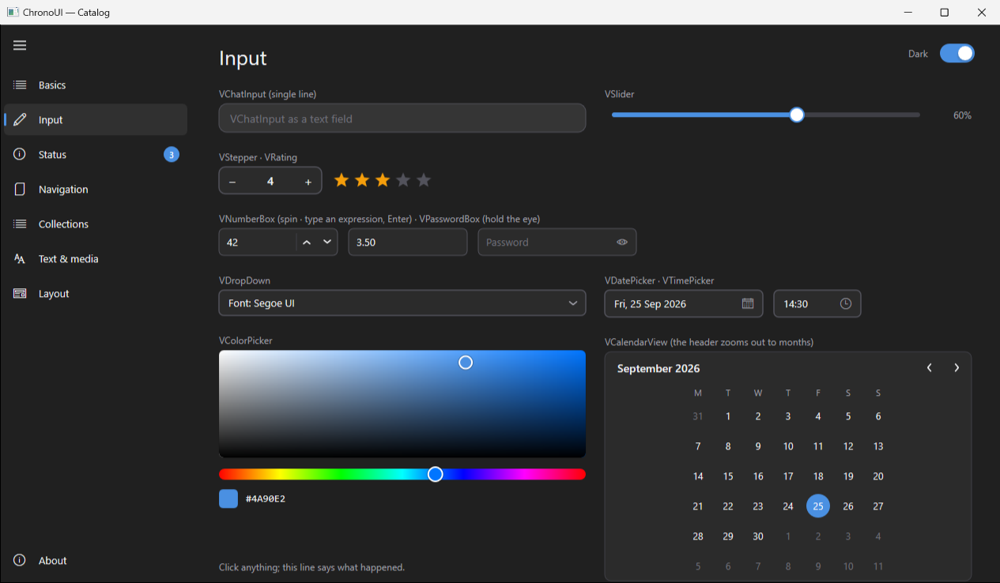

# ChronoUI — Widget Catalog

Every widget is a C++ class in one of the headers under `include/`, and every
one has the same shape on purpose, so that a model that has used one can use
the rest: a constructor with what the widget shows, chainable setters that
return `*this`, one `OnChange`-style callback, `SetBounds` for where it goes,
and colours read from the theme at draw time. About seventy of them, named
after the WinUI 3 controls they correspond to where there is one.

| Header | What is in it |
|---|---|
| `VirtualWidget.hpp` | The host `VirtualWindow`, the widget contract, the theme, `VLabel`, `VButton`, `VCombo` |
| `VDraw.hpp` | The `vd::` drawing vocabulary every `OnDraw` uses |
| `VControls.hpp` | Toggle, check, radio, segment, slider, stepper, progress, colour picker |
| `VNavigation.hpp` | Navigation view, tabs, expander, info bar, flyouts, menu, date and time pickers, teaching tip, selector bar, pivot, calendar |
| `VCollections.hpp` | List, tree, grid, flip view, pips pager, annotated scrollbar |
| `VActions.hpp` | Dropdown, command bar, breadcrumb, dialog, link, menu bar, split buttons, toggle button, suggestions, repeat button, command bar flyout |
| `VIndicators.hpp` | Progress ring, rating, badge, person picture |
| `VText.hpp` | Number box, password box, rich text |
| `VMedia.hpp` | Icon, animated icon, image, shapes |
| `VLayout.hpp` | Scroll viewer, split view, two-pane view |
| `VInstruments.hpp` | Gauge, analog clock, vitals trace, equalizer, plot |
| `VEffects.hpp` | Eyes, snow, storm, ticker, busy veil |
| `VirtualChat.hpp` | Chat bubbles, code block, typing indicator, the text editor |

---

## The host: `VirtualWindow`

A `VirtualWindow` owns **one HWND and one render target** and hosts a scene
graph of C++ objects. Hit-testing, hover, capture, focus, keyboard routing,
tooltips, scrolling and a 60 Hz animation heartbeat are all done in C++ on the
container. Behind it, `ChronoController.hpp` holds the Direct2D, DirectWrite
and WIC factories; that is the only thing the framework shares between windows.

- `Add<T>()` — scrollable content (content space, can exceed the viewport).
- `AddChrome<T>()` — pinned chrome (header bars, input strips, side panels);
  painted on top, hit-tested first, never scrolls. `BringChromeToFront` for overlays.
- `SetSafeAreaInsets(top,right,bottom,left)` — content is clipped inside the chrome.
- Scrolling: `SetContentHeight`, `ScrollToBottom`, `IsAtBottom`, wheel handling
  with a window-level `OnWheelHook`.
- `Create(hInst, title, w, h, customChrome, titleBarH, deferShow)` — borderless
  window with a painted title bar; drag/resize handled through `WM_NCHITTEST`
  (decorative chrome falls through to the caption, interactive chrome does not).
- Hooks: `OnResize`, `OnScroll`, `OnTick(dt)`, `OnMessage(msg,wp,lp)` for
  `WM_APP+N` from worker threads, `EnableFileDrop` + `OnFilesDropped`.
- Hooks: `OnKeyHook` sees every key before the focused widget (a suggestion list steering the arrows), `OnWheelHook` the same for the wheel.
- Focus: `SetFocusWidget`, `CycleFocus(±1)` (what Tab / Shift+Tab call: every visible
  widget whose `CanFocus()` is true, content first then chrome), and `RemoveWidget` /
  `RemoveChrome` keep capture/hover/focus consistent.
- Tooltips: any `VirtualWidgetImpl::SetTooltip(text)`; the host shows a dark pill after ~0.55 s.
- Modal use: `SetSuppressQuitOnClose(true)` for dialogs that must not end the app.

## The contract: `IVirtualWidget` / `VirtualWidgetImpl`

`OnDraw(pRT)`, `OnUpdate(dt) -> bool` (ask for another frame), `OnMouseDown/Up/Move/Enter/Leave/Wheel`,
`OnKeyDown`, `OnChar`, `OnFocus`, `CanFocus`, `HitTest`, plus a string property
store and `OnClick`. Return `VInputResult::Capture` from a mouse-down to receive
the drag until release.

Containers do not own children: `VSplitView`, `VTwoPaneView`, `VExpander` and
`VNavView` own their geometry and motion, hand out rects, and call `OnLayout`
while they move; the app's one `layout()` function places everything. There is
no parent-child tree and none was needed.

`src/examples/VirtualShowcase.cpp` exercises all of the above in one window
(custom chrome, two layers, chat widgets, tooltips, animation, file drop,
scroll-aware chrome) and is the file to copy when starting an app. The other
examples in [EXAMPLES.md](EXAMPLES.md) each isolate one idea.

## Theme: light and dark

Every widget paints with the palette in `VTheme` (`VirtualWidget.hpp`),
read at draw time through `vtheme::Current()` and the `vctl::` shorthands
(`Ink`, `Muted`, `Dim`, `Surface`, `Subtle`, `Border`, `Outline`, `Track`,
`Blue`, `Pill`, `Hover(alpha)`). `vtheme::SetDark(true)` and a repaint restyle
a whole window; an app sets its background from the same place:

```cpp
vtheme::SetDark(true);
win.SetBackground(vtheme::Current().window);
```

A widget given an explicit colour (`VLabel::Color`, `VButton::Face`...) keeps
it in both themes; a `VLabel` with no colour, or `Muted(true)`, follows the
theme. The accent is the same blue in both. `VCombo` and `VChatInput` take
their defaults from the theme current when they are created. The Catalog and
Booking examples have a Dark toggle at the top right and accept `dark` on the
command line.



## Drawing: `VDraw.hpp`

`namespace vd` holds what an `OnDraw` reaches for: `Col`/`Mix`/`Alpha` for
colours, `Lerp`/`EaseOut`/`EaseInOut`/`Approach` for motion, `Rect`/`Inset`/
`LerpRect`, `Fill`/`Stroke`/`Gradient`/`Circle`/`Ring`/`Line`/`Shadow`,
`Polyline` (open or filled) and `Arc` on path geometry, and `Text`/`TextWidth`
with a fluent `vd::Style()` (`.Size().Bold().Center().Wrap().Mono().Icon()`).
Brushes and formats are created per call — cheap in Direct2D, and it keeps
widgets free of cached resources.

## The widgets

| Widget | Header | What it is |
|---|---|---|
| `VLabel` | VirtualWidget.hpp | Single-line text: `Text`, `FontSize`, `Color` or `Muted`; follows the theme when no colour is set. |
| `VButton` | VirtualWidget.hpp | Rounded button with hover/press/disabled states, `OnClick`. |
| `VCombo` | VirtualWidget.hpp | Flat dropdown (native popup menu), `Items`, `Select`, `OnChange`. |
| `VToggle`, `VCheck`, `VRadio`, `VSegment`, `VSlider`, `VStepper`, `VProgress` | VControls.hpp | The everyday form controls, 30–60 lines each, animated with `vd::Approach`; all keyboard-operable and part of the Tab order. |
| `VColorPicker` | VControls.hpp | Saturation/value square, hue bar, swatch and hex; drag or arrows. `OnChange(D2D1_COLOR_F)`. |
| `VNavView` | VNavigation.hpp | Side navigation: glyph + label items, a footer, compact mode behind the menu button; `OnLayout` reports the animated width. |
| `VTabView` | VNavigation.hpp | A strip of closable tabs with an add button; `Add` / `Remove`, `OnChange` / `OnClose` / `OnAdd`. |
| `VExpander` | VNavigation.hpp | A card with a header that opens a content area; `ShownHeight` and `ContentRect` for the children, `OnLayout` while it animates. |
| `VInfoBar` | VNavigation.hpp | Inline message with a severity, an optional action and a close button; collapses to nothing when closed. |
| `VFlyout` | VNavigation.hpp | The light-dismiss popup base: covers the window while open, closes on outside click / Esc / focus loss, derived classes draw the panel. |
| `VFlyoutButton` | VNavigation.hpp | A button that opens its own flyout beneath it; `DrawButton` + `DrawPanel`. `VDatePicker`, `VDropDown` and `VCommandBar` are built on it. |
| `VMenu` | VNavigation.hpp | A menu flyout: glyph, label, shortcut, separators, check items; keyboard and mouse. |
| `VDatePicker` | VNavigation.hpp | A date button that opens a calendar flyout; arrows move the day, PgUp/PgDn the month. `vdate::` has the date arithmetic. |
| `VTimePicker` | VNavigation.hpp | A time button opening an hour / minute grid; arrows nudge. `VTime {h, m}`. |
| `VTeachingTip` | VNavigation.hpp | A callout with a beak towards its anchor: title, wrapped body, close, an action. `Show(anchor)`. |
| `VSelectorBar` | VNavigation.hpp | Glyph + label choices in a row with a sliding underline; `OnChange`. |
| `VPivot` | VNavigation.hpp | The same strip in large type and no glyphs: section headers over content the app swaps. |
| `VCalendarView` | VNavigation.hpp | An inline month: pick a day, arrows and PgUp/PgDn move, the header zooms out to the twelve months; `OnChange(VDate)`. |
| `VListView` | VCollections.hpp | Glyph / title / subtitle rows with single or multi selection (Ctrl, Shift, Ctrl+A), own scrolling, `Erase`. |
| `VTreeView` | VCollections.hpp | Nested nodes with chevrons; open state lives in the node, arrows walk and fold, `OnSelect`. |
| `VGridView` | VCollections.hpp | Tiles painted by a callback with captions; columns from the width, own scrolling, list-style selection. |
| `VFlipView` | VCollections.hpp | One page at a time, painted by a callback; arrows, keys and wheel flip, the pages slide; `OnChange`. |
| `VPipsPager` | VCollections.hpp | The dots under a flip view, with optional arrows; `Count`, `Select`, `OnChange`. |
| `VAnnotatedScrollBar` | VCollections.hpp | A tall scrollbar with labels along it and a tooltip while dragging; `Value` 0..1, `ThumbSize`, `OnChange`. |
| `VDropDown` | VActions.hpp | A drawn combo box: `Items`, `Select`, `Prefix`, `OnChange`; the list is a flyout. |
| `VCommandBar` | VActions.hpp | Icon + label buttons in a row; what does not fit goes behind "..." into an overflow flyout. `Add`, `Separator`, `Enable`, `OnPick`. |
| `VBreadcrumb` | VActions.hpp | A › B › C with the parents clickable; collapses the middle to "…" when narrow. `OnPick(parent index)`. |
| `VDialog` | VActions.hpp | Modal content dialog: scrim, title, wrapped body, Primary / Secondary / Close, Enter and Esc; `OnResult(0/1/2)`. |
| `VLink` | VActions.hpp | A hyperlink: underline on hover or focus, `OnClick`, Enter activates. |
| `VMenuBar` | VActions.hpp | File / Edit / View menus in a bar; the open menu follows the mouse across titles; `OnPick(menu, item)`. |
| `VSplitButton` | VActions.hpp | Main part fires `OnClick`, the chevron opens a menu, `OnPick`. |
| `VToggleButton` | VActions.hpp | Glyph (+ label) button that stays pressed; `Set`, `Value`, `OnChange`. |
| `VSuggestions` | VActions.hpp | The list under a search box: shown with `Show(anchor, items)`, steered with `HandleKey` from `OnKeyHook`, never takes focus. |
| `VRepeatButton` | VActions.hpp | A button that fires on the press and keeps firing while held; `Delay`, `Interval`. |
| `VToggleSplitButton` | VActions.hpp | A split button whose main part is on or off: `Set`, `Value`, `OnChange`; the chevron's menu through `OnPick`. |
| `VCommandBarFlyout` | VActions.hpp | A floating row of glyph commands with a "..." that unfolds the secondary rows; `Show(anchor)`, `OnPick`. |
| `VProgressRing` | VIndicators.hpp | Spinning arc while `Active`, or a determinate ring with `Set(0..1)`. |
| `VRating` | VIndicators.hpp | Stars: hover previews, click sets (again to clear), arrows nudge; `Max`, `OnChange`. |
| `VBadge` | VIndicators.hpp | A count pill (99+) or a dot, in a colour. `VNavView::Badge` draws the same thing on a navigation row. |
| `VPersonPicture` | VIndicators.hpp | Initials on a colour hashed from the name (`vd::Avatar`), or a glyph. |
| `VNumberBox` | VText.hpp | A numeric field with spin buttons, `Range`, `Step`, `Decimals`; it evaluates what is typed (`2*(3+4)`) and turns red on a bad expression. |
| `VPasswordBox` | VText.hpp | Bullets while typing; the eye reveals while held; `OnChange`, `OnSubmit`. |
| `VRichText` | VText.hpp | A wrapped paragraph from `**bold**`, `*italic*`, `` `code` `` and `[text](url)`; links light up and fire `OnLink`; `MeasureHeight(width)` for the layout. |
| `VIcon` | VMedia.hpp | One Segoe MDL2 Assets glyph, a size, a colour. |
| `VAnimatedIcon` | VMedia.hpp | A glyph that swells under the mouse and bounces on click; `OnClick`. |
| `VImage` | VMedia.hpp | A picture from a file through WIC: None / Fill / Uniform / UniformToFill, rounded corners, a placeholder when the file is missing. |
| `VShape` | VMedia.hpp | Rectangle, ellipse, line or polygon with a fill and a stroke; points as fractions of the bounds. |
| `VScrollViewer` | VLayout.hpp | A viewport over painted content: wheel, Shift+wheel sideways, Ctrl+wheel zooms about the cursor, drag pans, thumbs on both edges; `Content(w, h)`, `Paint`. |
| `VSplitView` | VLayout.hpp | A pane beside the content: Inline / Overlay / CompactInline / CompactOverlay, animated; `PaneRect`, `ContentRect`, `OnLayout`. |
| `VTwoPaneView` | VLayout.hpp | Two areas side by side when wide, stacked when tall, with a draggable divider; `Pane1Rect`, `Pane2Rect`, `OnLayout`. |
| `VGauge` | VInstruments.hpp | A 270° arc with a needle, coloured zones, ticks and a readout; `Range`, `Set` (glides), `Zones`, `Fill`, `Unit`. A speedometer, an engine temperature or a battery are three configurations. |
| `VAnalogClock` | VInstruments.hpp | Hours, minutes and a sweeping second hand, live. |
| `VVitals` | VInstruments.hpp | A CRT-style trace behind a sweep bar: `Push(0..1)` your signal, or `Simulate(true)` for a heartbeat at `Rate` bpm. |
| `VEqualizer` | VInstruments.hpp | LED bars with peak hold, green / amber / red; `Set(levels)` or `Simulate`. |
| `VPlot` | VInstruments.hpp | A scrolling line plot with a filled area: `Push(value)`, `Range`, `Capacity`, `Label`, `Unit`. |
| `VEyes` | VEffects.hpp | Two eyes whose pupils follow the mouse anywhere on the screen, and blink; `Window(hwnd)`. |
| `VSnow` | VEffects.hpp | Flakes drifting down over its bounds; the mouse passes through. `Count`, `Wind`. |
| `VStorm` | VEffects.hpp | Rain, and every few seconds a bolt and a flash; passes through. `StrikeNow()`. |
| `VTicker` | VEffects.hpp | A line of text scrolling across a dark bar; `Text`, `Speed`, `Colors`. |
| `VBusy` | VEffects.hpp | A veil with a spinning ring over what it covers while `Active`; takes the clicks. |
| `VChatBubble` | VirtualChat.hpp | User/assistant message bubble: word-wrap, markdown-ish rendering, inline images, streaming text, self-measuring height. |
| `VCodeBlock` | VirtualChat.hpp | Monospace dark code block with language label and copy affordance. |
| `VTypingIndicator` | VirtualChat.hpp | Three animated dots driven by the heartbeat. |
| `VChatInput` | VirtualChat.hpp | Multi-line editor with caret, selection, clipboard, attachments and Send/Stop. |
| `VStackItem` / chat layout | VirtualChat.hpp | Stacks widgets vertically, measures total height for scrolling. |

### Widgets in the apps built on it

Not part of the framework and not in this repository (the apps have their own),
but listed as proof of what the contract above carries: each is one header.

| Widget | App | Purpose |
|---|---|---|
| `VMindMap` | ClaudeMM | Two-sided tidy tree with pan/zoom, folding, drag & drop, flashing, live pulses. |
| `VSessionListPanel`, `VInspectorPanel`, `VPickerButton` + `VPickerPopup` | ClaudeMM | Searchable list with inline tag editor, right inspector with multi-line note editor, project picker popup. |
| `VWorldClock` | JLToys | Rack of city clocks with day/night tint, scrolling, time shifting. |
| `VNoteList` | JLToys | Sticky-note list with alarms and archiving. |

---

## Writing a new widget

```cpp
class VDot : public ChronoUI::VirtualWidgetImpl {
    float m_t = 0.f;
public:
    const char* GetTypeName() const override { return "VDot"; }
    bool OnUpdate(float dt) override { m_t += dt; return true; }     // animate every frame
    void OnDraw(ID2D1RenderTarget* rt) override {
        vd::Circle(rt, vd::CX(m_bounds), vd::CY(m_bounds), 8.0f, vd::Alpha(vctl::Blue(), 0.6f + 0.4f * sinf(m_t * 3)));
    }
};

// in wWinMain:
ChronoControllerImpl::Instance();
VirtualWindow win;
win.Create(hInst, L"Dot", 320, 200);
auto* dot = win.Add<VDot>();
dot->SetBounds(D2D1::RectF(140, 80, 180, 120));
return win.RunMessageLoop();
```

Rules that keep it fast and consistent: paint in the host's coordinate system
using your own `GetBounds()`; return `Handled` from `OnMouseMove` **only** when
something visible changed (that is what triggers a repaint); read colours from
`vctl::` so it works in both themes; and never block the UI thread — post
`WM_APP+N` from workers and handle it in `OnMessage`.

---

## Where the screenshots come from

`tools/shoot.ps1` launches an exe, waits for its window, optionally drives it
(typing, keys, clicks) and saves the window as PNG. The gallery in
`docs/screenshots/` is regenerated with it; the Catalog takes a page number
and `dark` on the command line so every page can be shot without a click.
